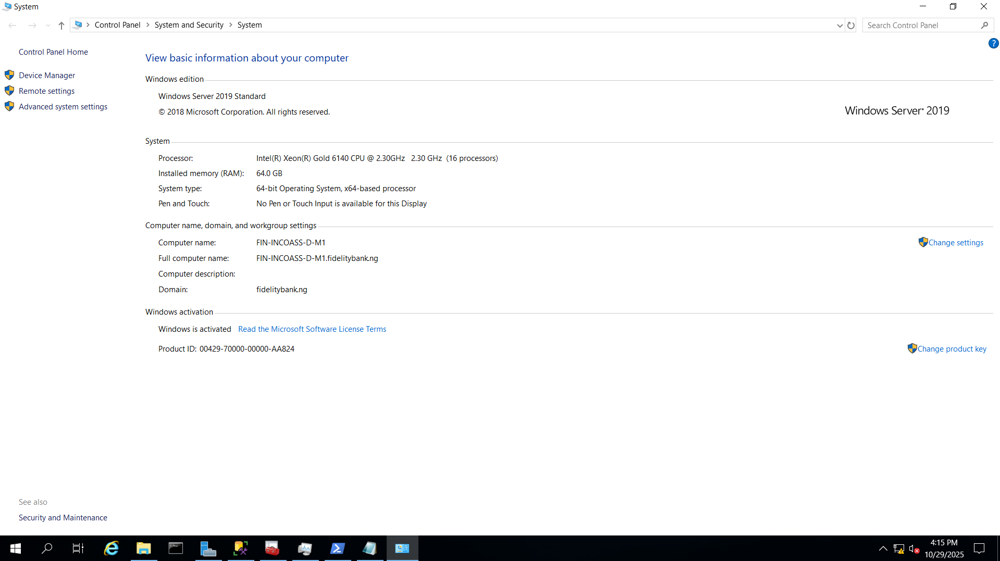
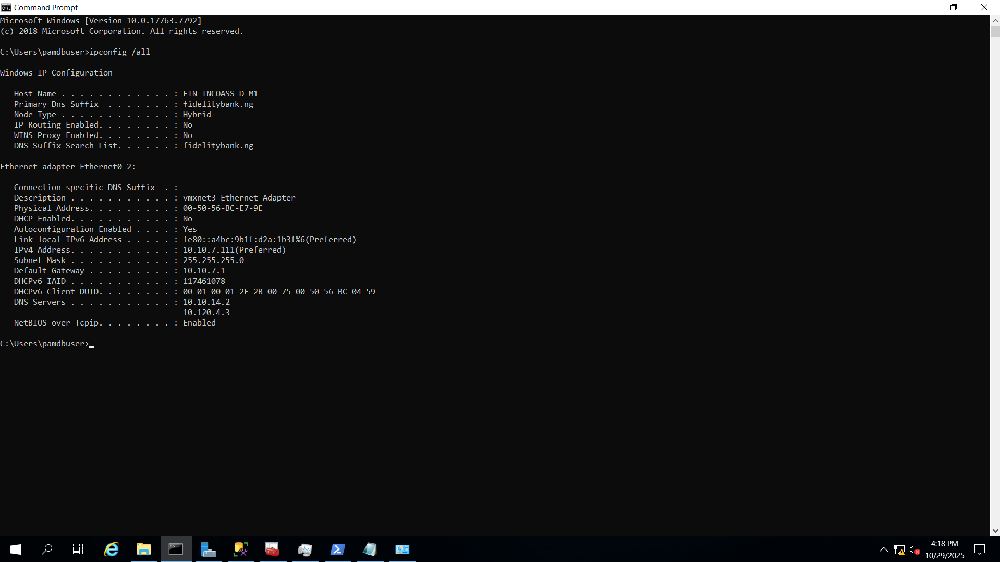
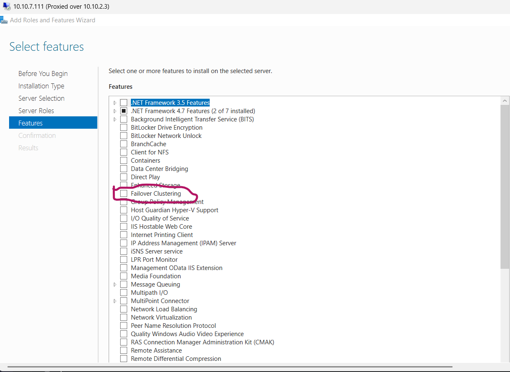
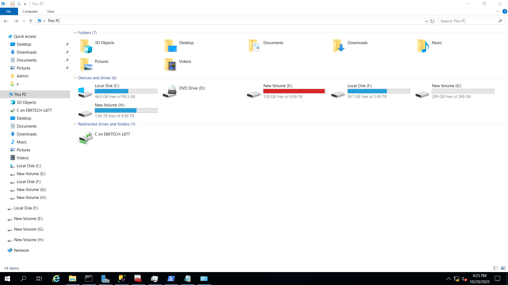
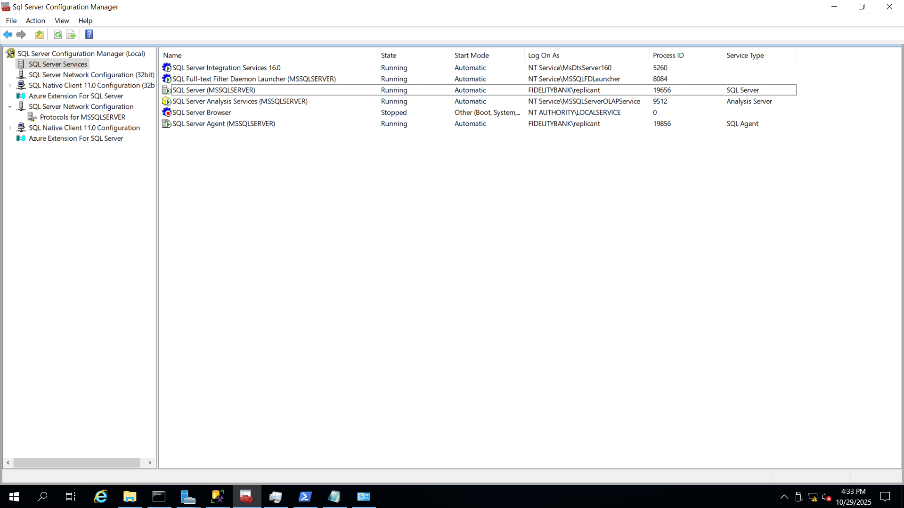
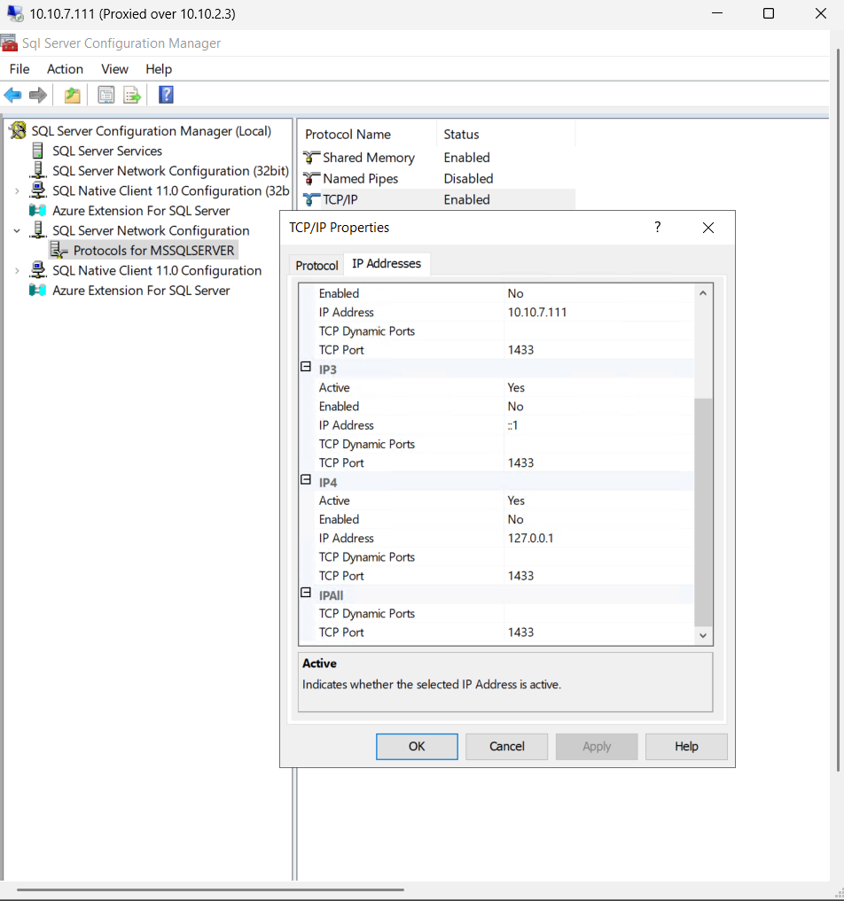
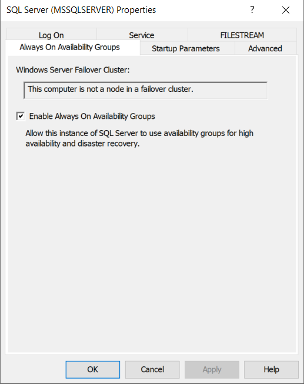
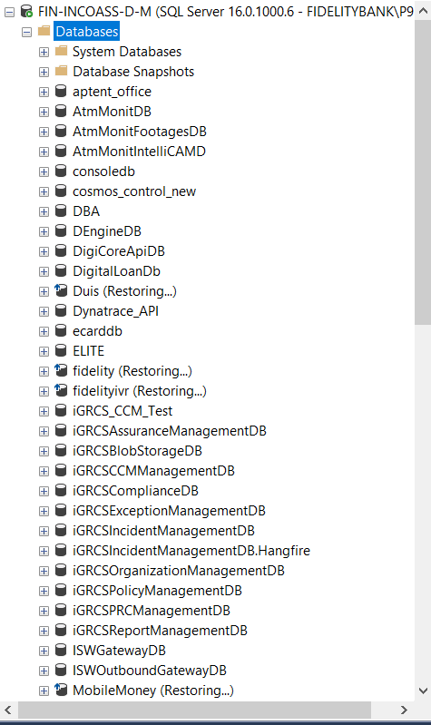

# 🧱 Baseline (Pre-Cluster) Configuration – Primary SQL Server

## 1. Objective
Establish the baseline configuration of the standalone SQL Server instance before enabling Windows Failover Clustering or Always On.  
This ensures audit traceability, environment reproducibility, and validation before cluster deployment.

---

## 2. Server Overview
| Parameter | Value |
|------------|--------|
| Hostname | FIN-INCOASS-D-M |
| Domain | fidelitybank.ng |
| IP Address | 10.10.7.111 |
| Subnet | 10.10.7.0/24 |
| OS Version | Windows Server 2019 Standard |
| SQL Version | SQL Server 2019 (16.0.1000.6) |
| Collation | SQL_Latin1_General_CP1_CI_AS |

### Screenshots
  
*Figure 1: Hostname, domain membership, and OS configuration.*

  
*Figure 2: Static IP configuration, DNS, and gateway settings.*

  
*Figure 3: Failover Clustering feature not yet installed, confirming baseline state.*

---

## 3. Storage Layout
| Drive | Purpose | File System | Capacity |
|--------|----------|-------------|-----------|
| C: | Operating System | NTFS | 100 GB |
| E: | Data Files | NTFS | 5 TB |
| F: | Transaction Logs | NTFS | 2.5 TB |
| G: | Backups | NTFS | 300 GB |
| H: | Archive | NTFS | 5 TB |

  
*Figure 4: Drive layout confirming storage separation for data, logs, and backups.*

---

## 4. SQL Server Configuration

### 4.1 SQL Services
  
*Figure 5: SQL and Agent services running under domain accounts.*

### 4.2 Network Configuration
  
*Figure 6: TCP/IP protocol enabled with static port 1433.*

### 4.3 Always On Availability Group Setting
  
*Figure 7: Always On enabled, but node not yet joined to a Failover Cluster.*

### 4.4 Databases
  
*Figure 8: Current databases on the instance that will later join an Availability Group.*

---

## 5. Baseline Validation Summary

| Validation Item | Status | Comments |
|-----------------|---------|-----------|
| Domain Join | ✅ | Joined to fidelitybank.ng |
| Static IP Assigned | ✅ | 10.10.7.111 |
| Windows Failover Clustering Installed | ❌ | Not yet installed |
| SQL Services Running | ✅ | Service accounts verified |
| TCP/IP Enabled on Port 1433 | ✅ | Static configuration |
| Always On Enabled | ⚠️ | Enabled but not clustered |
| Databases Present | ✅ | Multiple production DBs available |
| Witness Configured | ❌ | To be added post-cluster |

---

## 6. Notes
> This document represents the verified baseline configuration of the **Primary SQL Server** before any Always On or cluster integration.  
> It establishes the “before” snapshot for comparison during the **Post-Cluster Configuration** phase.

---

## 7. Next Steps
1. Install **Failover Clustering** feature on both nodes.  
2. Validate network reachability and DNS forward/reverse lookups.  
3. Create a new Windows Cluster and add nodes.  
4. Configure **File Share Witness** on DC01.  
5. Enable and validate Always On Availability Groups.

---

📁 **Screenshot Source Folder:**  
`/docs/screenshots/pre-cluster/`

